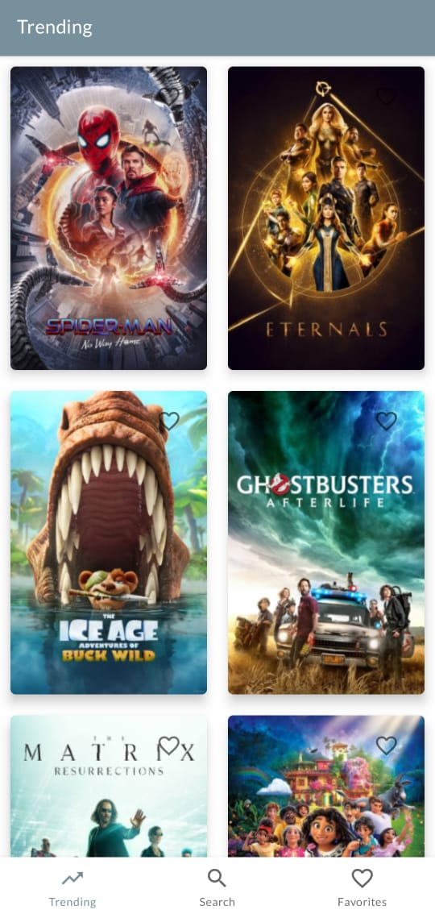
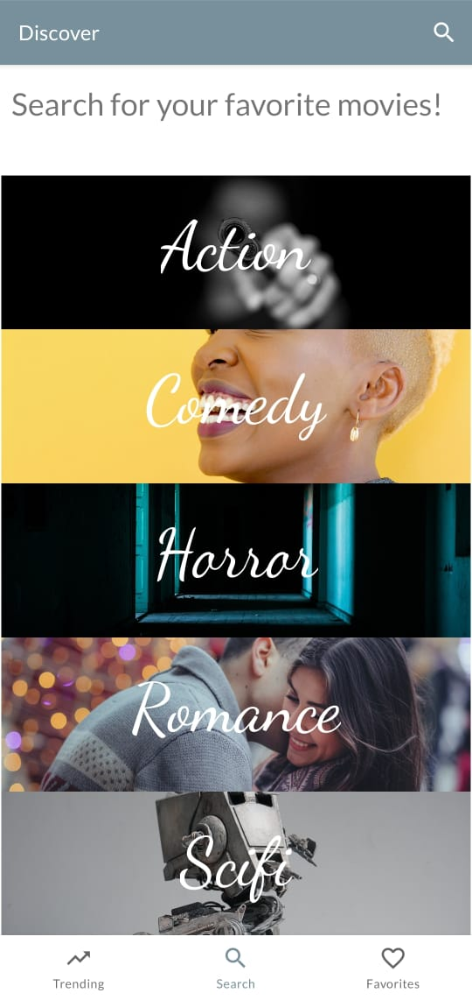
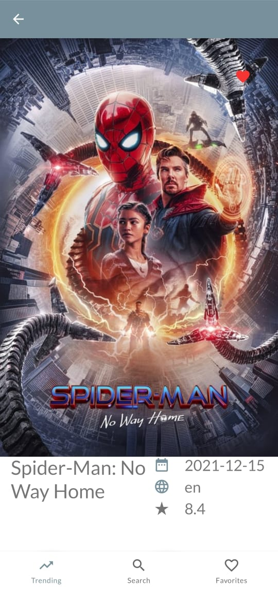
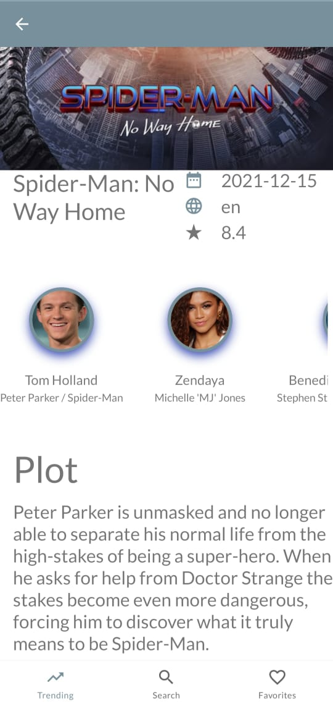
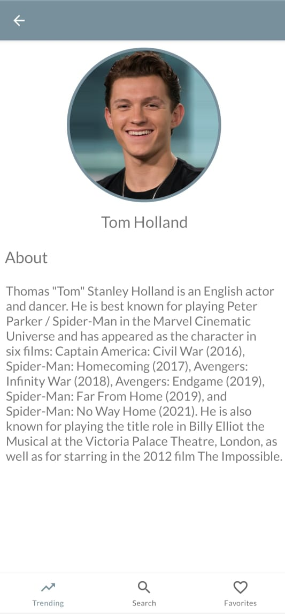
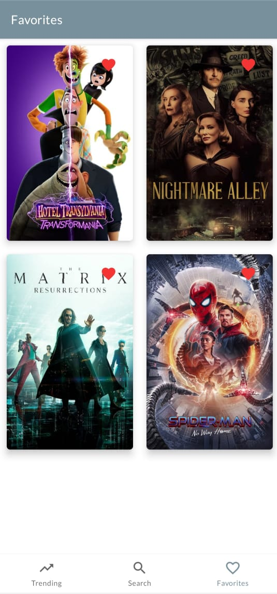

# MyMovies

A simple Android project using modern Android development tools and libraries.
## Screenshots

 

   &nbsp;
   &nbsp;
   &nbsp;
   &nbsp;
   &nbsp;
   &nbsp;

## About

A movies app where the user can browse movies based on different categories, discover a movie's ratings, plot, and many other attributes. The user also has the option to add the movie to a favorites tab.

## Architecture

This application is done with the [model-view-viewmodel (MVVM) architecture](https://developer.android.com/jetpack/guide).

## Technologies and Libraries Used

* [Livedata](https://developer.android.com/topic/libraries/architecture/livedata) - Automatically updates the UI when data changes
* [Recyclerview](https://developer.android.com/guide/topics/ui/layout/recyclerview) - Used for displaying items in a more efficient manner
* [Fragments](https://developer.android.com/guide/fragments) - Exposes the app's UI
* [ViewModel](https://developer.android.com/topic/libraries/architecture/viewmodel) - Holds the data
* [View Binding](https://developer.android.com/topic/libraries/view-binding) - Binds the data to the layouts in the xml
* [Navigation](https://developer.android.com/guide/navigation) - Navigate through the app using bottom navigation view
* [Retrofit](https://square.github.io/retrofit/) - Fetches the data from the REST API
* [Room](https://developer.android.com/training/data-storage/room) - Holds the favorite movies data
* [Coroutines](https://developer.android.com/kotlin/coroutines) - Used to access the API and the local database under the hood
* [Dependency Injection using Dagger-Hilt](https://developer.android.com/training/dependency-injection/) - Inject dependencies in the classes

## API

The API used in this application is [The Movie Database(TMDB) API](https://www.themoviedb.org/documentation/api)

